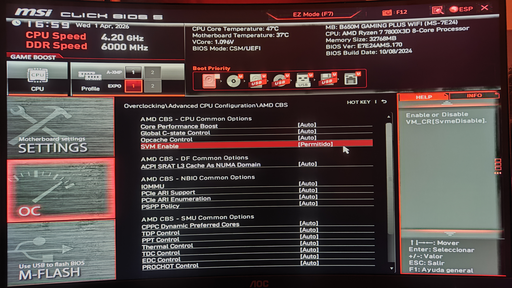
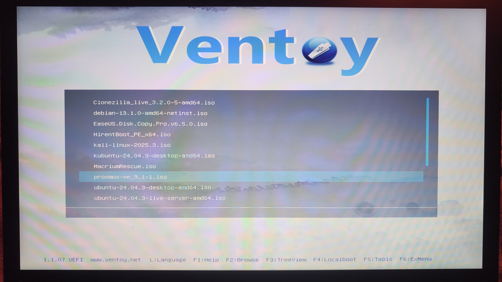
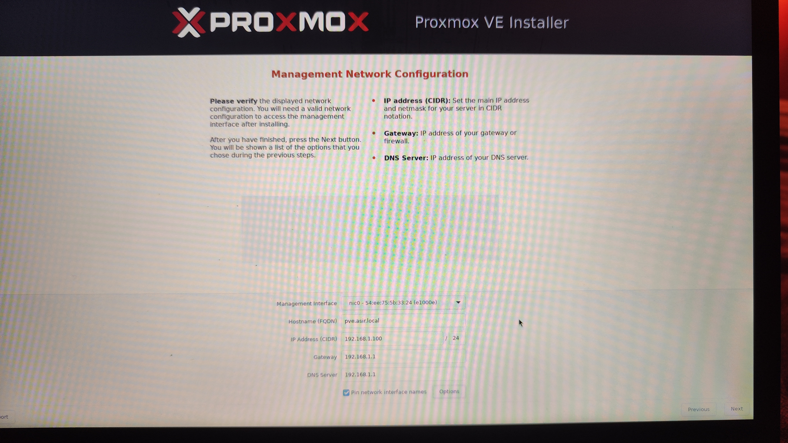

# Guía de Instalación de Proxmox VE 9.x

Esta guía detalla el proceso de instalación de Proxmox Virtual Environment (PVE) en un servidor físico. Proxmox es una plataforma de virtualización de código abierto basada en Debian Linux que nos permitirá gestionar las máquinas virtuales de nuestro clúster de Kubernetes de forma eficiente.

## 1. Configuración Previa: La BIOS
Antes de iniciar la instalación, es imperativo habilitar las funciones de virtualización en el hardware. Sin esto, no podremos ejecutar máquinas virtuales de 64 bits o el rendimiento será extremadamente pobre.

* **Acción:** Entrar en la BIOS/UEFI (normalmente pulsando `Supr` o `F2` al arrancar).
* **Ajuste Crítico:** Buscar y activar **SVM Mode** (en procesadores AMD) o **Intel VT-x** (en procesadores Intel).
* **Por qué:** Esta opción permite que el procesador preste sus capacidades directamente a las máquinas virtuales, eliminando la sobrecarga de emulación por software.

## 2. Preparación del Medio de Arranque
Utilizaremos una herramienta como **Ventoy** o **Etcher** para flashear la ISO oficial de Proxmox en un pendrive USB.

* **Acción:** Seleccionar la imagen `proxmox-ve_X.X-X.iso` desde el menú de arranque.
* **Detalle:** En la captura vemos el uso de Ventoy, una herramienta excelente que permite tener múltiples ISOs en un solo USB.

## 3. Selección del Disco de Instalación
Una vez cargado el instalador gráfico, debemos elegir dónde se alojará el sistema operativo y los datos.

* **Acción:** Seleccionar el disco de destino (Target Harddisk). En este caso, un disco de 500GB (`/dev/sdc`).
* **Opciones Avanzadas:** Se recomienda usar el sistema de archivos **ext4** para instalaciones sencillas o **ZFS** si se dispone de varios discos para redundancia (RAID).
* **Nota:** Proxmox particionará el disco automáticamente creando volúmenes para el sistema (root) y para el almacenamiento de máquinas virtuales (data).

## 4. Configuración de Red de Gestión (Management)
Este es el paso más crítico para la futura administración remota. Proxmox **requiere** una IP estática; no se debe usar DHCP para el servidor.

* **Hostname (FQDN):** El nombre del servidor en formato dominio (ej: `pve.asir.local`).
* **IP Address:** La dirección que usaremos para entrar al panel web (ej: `192.168.1.100`).
* **Gateway/DNS:** Normalmente la IP de nuestro router (ej: `192.168.1.1`).
* **Por qué:** Si la IP cambiara por DHCP, perderíamos la conexión con el clúster de Kubernetes y el panel de control web.

## 5. Resumen y Confirmación
El instalador presenta un resumen de todas las opciones elegidas. Es la última oportunidad para verificar que el disco de destino y la configuración de red son correctos antes de borrar los datos existentes.

## 6. Finalización y Acceso Web
Tras unos minutos, el sistema indicará que la instalación ha sido exitosa.

* **Acción:** Reiniciar el servidor y retirar el USB.
* **Acceso:** Desde cualquier otro ordenador de la misma red, abre un navegador y escribe la URL que se muestra en pantalla: `https://192.168.1.100:8006`.
* **Nota:** Es normal recibir un aviso de "Conexión no segura" la primera vez; esto se debe a que Proxmox usa un certificado SSL auto-firmado. Debemos pulsar en "Avanzado" y "Continuar".

---
**Siguiente Paso:** Una vez dentro del panel web, procederemos a la creación de las máquinas virtuales para el Control Plane y los Workers de nuestro clúster.
