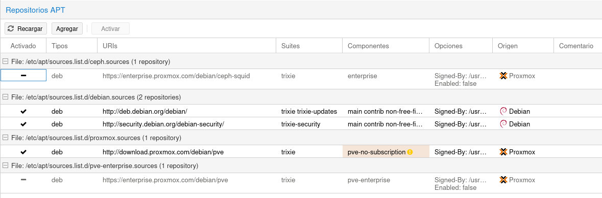
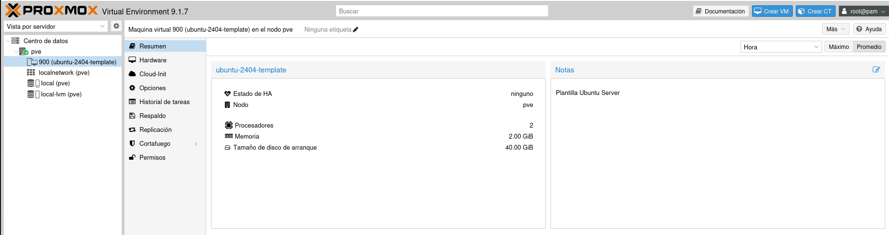
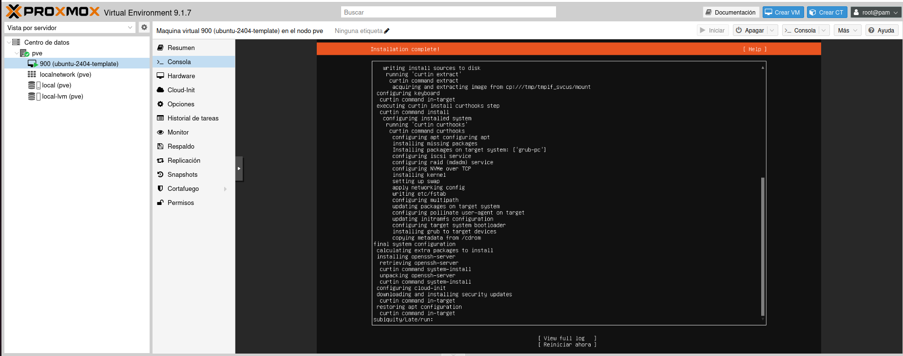

# 🖥️ Fase 2: Configuración de Proxmox e Instalación de Ubuntu Server

<p align="center">
  
  
  
</p>

---

Esta guía detalla desde la obtención del software hasta la creación de una plantilla optimizada. El objetivo es que cualquier usuario, sin conocimientos previos, pueda replicar la infraestructura necesaria para el clúster de Kubernetes.

---

## 📥 1. Obtención de la Imagen ISO (Ubuntu Server)
Antes de tocar Proxmox, necesitamos el "instalador" del sistema operativo.

### Opción A: Subida Manual
1. **Descarga:** Ve a la web oficial de [Ubuntu Server](https://ubuntu.com/download/server).
2. **Versión:** Elige siempre la versión **LTS** (Long Term Support), en nuestro caso la **24.04**. Estas versiones garantizan estabilidad y actualizaciones durante 5 años.
3. **Subida a Proxmox:**
   - Entra en tu panel de Proxmox vía web.
   - En el menú izquierdo, haz clic en el almacenamiento llamado **`local (pve)`**.
   - Selecciona la pestaña **ISO Images**.
   - Haz clic en **Upload** y selecciona el archivo `.iso` que acabas de descargar de Ubuntu.

### Opción B: Descarga directa desde URL (Recomendada)
> [!TIP]
> Esta opción es más eficiente ya que el servidor Proxmox descarga la imagen directamente desde los servidores de Ubuntu, aprovechando la velocidad de red del servidor y evitando tener que subir el archivo desde tu ordenador.

1. **Copiar el enlace oficial:** Asegúrate de tener copiada esta URL de la versión **LTS 24.04.4**:
   `https://releases.ubuntu.com/24.04/ubuntu-24.04.4-live-server-amd64.iso`.
2. **Acceder a la herramienta:**
   - En el panel de Proxmox, selecciona el almacenamiento **`local (pve)`** a la izquierda.
   - Ve a la pestaña **ISO Images**.
3. **Ejecutar la descarga:**
   - Haz clic en el botón **Download from URL**.
   - Pega la dirección en el campo **URL**.
   - Pulsa en **Query URL** para que Proxmox identifique el archivo automáticamente.
   - Haz clic en **Download** y espera a que finalice el proceso.

---

## 🔄 2. Configuración de Repositorios y Actualización
Es fundamental preparar Proxmox para que pueda actualizarse sin una licencia de pago.

> [!IMPORTANT]
> **Acción Principal:** Selecciona el nodo `pve` -> **Updates** -> **Repositories**.

* **Limpieza:** Haz clic en el repositorio que dice `enterprise` y pulsa **Disable**.
* **Añadir:** Pulsa en **Add**, selecciona `No-Subscription` del desplegable y confirma.
* **Actualizar:** Ve a la pestaña **Updates** superior, pulsa **Refresh** y, cuando termine, **Upgrade**. Esto asegura que el hipervisor tenga los últimos parches de seguridad.



---

## ⚙️ 3. Creación de la Máquina Virtual (Paso a Paso)
Haremos clic en el botón azul **"Crear VM"** (esquina superior derecha) y seguiremos estas pestañas:

| Pestaña | Parámetro | Valor Configurado | Justificación |
| :--- | :--- | :--- | :--- |
| **General** | VM ID / Name | `100` (o `900`) / `ubuntu-2404-template` | Organización lógica para distinguir las plantillas. |
| **OS** | ISO Image | Imagen Ubuntu LTS 24.04 | Sistema operativo base subido previamente. |
| **System** | QEMU Agent | **Activado (MARCAR)** | **Vital** para comunicación Proxmox-VM (ver IP, apagar ordenadamente). |
| **Disks** | Disk size / Storage | **40 GB** / `local-lvm` o `local` | Espacio suficiente para SO y binarios de Kubernetes. |
| **CPU** | Cores / Type | **2** / **host** | Mínimo para K8s; "host" expone instrucciones del Ryzen 7 7800X3D mejorando rendimiento. |
| **Memory** | Memory (MiB) | **2048 (2 GB)** | Mínimo recomendado para un nodo de K8s estable. |
| **Network** | Bridge | `vmbr0` | Conexión directa a la red principal. |



---

## 🐧 4. Proceso de Instalación de Ubuntu (Interior de la VM)
Una vez creada, dale a **Start** y entra en la pestaña **Console**.

1. **Idioma y Teclado:** Español / Spanish.
2. **Type of Install:** Ubuntu Server (la estándar es más completa que la minimizada).
3. **Network:** Déjalo en DHCP por ahora (lo cambiaremos a estática con Netplan más adelante).
4. **Storage:** "Use an entire disk" y asegura que "Set up this disk as an LVM group" esté marcado.
5. **Profile Setup:** - **Your name / Username:** `asir` / `asir`
   - **Server's name:** `ubuntu-template`
   - **Password:** (Una que recuerdes bien).

> [!CAUTION]
> **SSH Setup:** **MARCAR "Install OpenSSH server"**. Sin esto, no podremos usar Ansible ni entrar por terminal remota.

* **Featured Snaps:** No selecciones nada. Queremos un sistema limpio.



---

## 📦 5. Preparación y Conversión a Template
Tras terminar, el sistema pedirá "Reboot Now". Quita el "medio de instalación" si Proxmox no lo hace solo y entra con tu usuario `asir`.

**1. Actualiza todo:**
```Bash
sudo apt update && sudo apt upgrade -y
```

**2. Instala el agente necesario:**
```Bash
sudo apt install qemu-guest-agent -y
sudo systemctl enable --now qemu-guest-agent
```

**3. Limpia el sistema:** Borra archivos temporales para que los clones pesen menos.
```Bash
sudo apt clean
sudo apt autoremove
```

**4. Convierte a Template:** Apaga la máquina (`sudo poweroff`). En la interfaz de Proxmox, haz clic derecho sobre la VM y selecciona **Convert to template**.

> [!NOTE]
> **¿Por qué hacemos esto?** Porque ahora, cada vez que necesitemos un nodo para el clúster, solo haremos clic derecho -> **Clone**, y en 10 segundos tendremos una máquina lista sin tener que repetir toda esta instalación.

---
<p align="center">
  <b>Siguiente Paso:</b> <a href="./03.Inicialización-del-Cluster-Kubernetes.md">Fase 3: Inicialización del Clúster Kubernetes</a><br><br>
  <b>Proyecto Integrado de Grado Superior ASIR</b><br>
  © 2026 - <a href="https://github.com/jobopaK">jobopaK</a>
</p>
