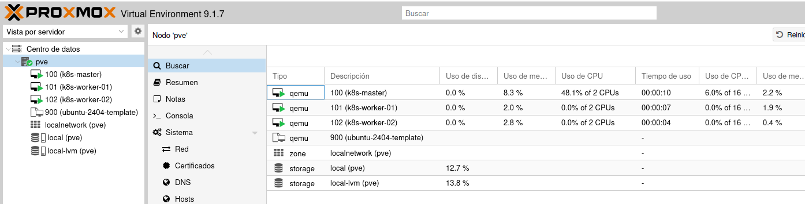
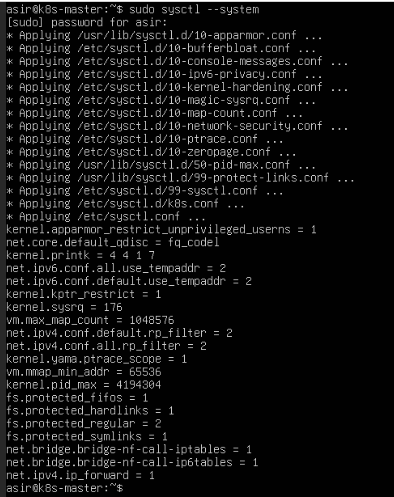
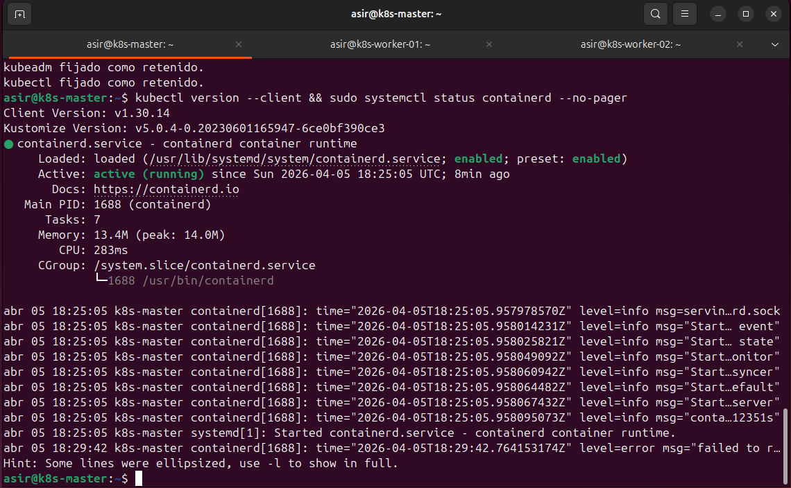
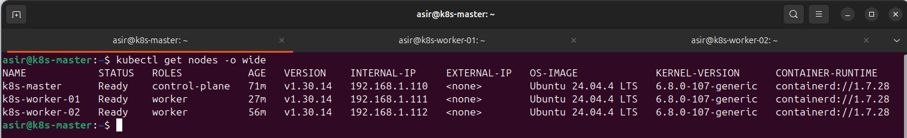

# ☸️ Fase 3: Despliegue del Clúster Kubernetes v1.30

<p align="center">
  
  
  
</p>

---

Esta guía contiene todos los comandos exactos y explicaciones detalladas para replicar el proceso de creación del clúster. Está diseñada para ejecutarse sobre una instalación limpia de Ubuntu Server 24.04 (clonada de nuestra plantilla de Proxmox).

---

## 🖥️ 1. Clonación de Nodos en Proxmox (Hardware Virtual)

Antes de configurar nada, necesitamos nuestras máquinas. Utilizaremos la plantilla `ubuntu-2404-template` que creamos anteriormente.

**Procedimiento:** Haz clic derecho sobre la plantilla -> **Clone**.

### Configuración de los Nodos y Red Estática (Netplan)
> [!IMPORTANT]
> Enciende las máquinas y configura sus IPs fijas. Es vital que no cambien por DHCP para no romper la comunicación del clúster.

| ID | Nombre del Nodo | Rol | Recursos Mínimos | IP Estática |
| :--- | :--- | :--- | :--- | :--- |
| **100** | `k8s-master` | Control Plane | 2 vCPUs / 2GB RAM | `192.168.1.110` |
| **101** | `k8s-worker-01` | Worker Node | 2 vCPUs / 2GB RAM | `192.168.1.111` |
| **102** | `k8s-worker-02` | Worker Node | 2 vCPUs / 2GB RAM | `192.168.1.112` |



### Configuración de IP Estática con Netplan (Paso a Paso)
Para aplicar estas IPs fijas, entraremos por consola a cada máquina recién clonada y configuraremos su red.

**1. Edición del archivo Netplan:**
Buscamos y editamos el archivo de configuración (el nombre suele ser `50-cloud-init.yaml` o `00-installer-config.yaml` dependiendo de la instalación):

```Bash
sudo nano /etc/netplan/50-cloud-init.yaml
```

**2. Configuración YAML (Ejemplo para el Master):**
> [!CAUTION]
> **Lección Aprendida:** En Ubuntu 24.04, el parámetro `gateway4` está obsoleto y causa pérdida de conexión a internet. Debemos usar el bloque `routes` explícitamente. Además, recuerda que YAML es estricto con la indentación (usa espacios, nunca tabuladores).

Sustituye el contenido por este, adaptando la IP (`192.168.1.110`) a la que corresponda a cada nodo:

```Yaml
network:
  ethernets:
    ens18:
      dhcp4: false
      addresses:
        - 192.168.1.110/24
      routes:
        - to: default
          via: 192.168.1.1
      nameservers:
        addresses:
          - 8.8.8.8
          - 1.1.1.1
  version: 2
```

**3. Aplicar los cambios:**
Guarda el archivo (`Ctrl+O`, `Enter`, `Ctrl+X`) y aplica la nueva configuración de red:

```Bash
sudo netplan apply
```

---

## ⚙️ 2. Preparación del Sistema (Ejecutar en MASTER y WORKERS)

Antes de instalar Kubernetes, con las máquinas encendidas y accesibles, debemos preparar el Kernel de Linux.

### A. Desactivar la memoria SWAP
Kubernetes requiere que la memoria SWAP esté apagada para que el programador (*scheduler*) pueda asignar recursos de forma precisa sin latencias de disco.

**1. Apagado inmediato:**
```Bash
sudo swapoff -a
```

**2. Apagado persistente:**
Editamos el archivo de montajes del sistema para que no se active al reiniciar:

```Bash
sudo nano /etc/fstab
```

> [!TIP]
> *Busca la línea que contiene la palabra `swap` (suele ser la última) y pon un símbolo `#` al principio para comentarla. Guarda con `Ctrl+O`, `Enter` y sal con `Ctrl+X`*.

### B. Configuración de Módulos de Kernel y Reenvío IP
Necesitamos que el sistema cargue los drivers de red necesarios y permita que los nodos actúen como routers para los contenedores.

**1. Cargar módulos y configurar parámetros de red:**
```Bash
# Configurar carga de módulos al arranque
cat <<EOF | sudo tee /etc/modules-load.d/k8s.conf
overlay
br_netfilter
EOF

# Cargar módulos ahora mismo
sudo modprobe overlay
sudo modprobe br_netfilter

# Configurar parámetros de red permanentes
cat <<EOF | sudo tee /etc/sysctl.d/k8s.conf
net.bridge.bridge-nf-call-iptables  = 1
net.bridge.bridge-nf-call-ip6tables = 1
net.ipv4.ip_forward                 = 1
EOF

# Aplicar cambios sin reiniciar
sudo sysctl --system
```



---

## 📦 3. Instalación del Motor de Contenedores (Containerd)

Kubernetes necesita un "Runtime" para ejecutar los contenedores. Usaremos **containerd**.

**1. Instalar y configurar Containerd:**
```Bash
sudo apt update && sudo apt install -y containerd

# Generar configuración limpia
sudo mkdir -p /etc/containerd
containerd config default | sudo tee /etc/containerd/config.toml

# Activar SystemdCgroup (PASO VITAL para la estabilidad)
sudo sed -i 's/SystemdCgroup = false/SystemdCgroup = true/g' /etc/containerd/config.toml

# Reiniciar el servicio
sudo systemctl restart containerd
```

> [!CAUTION]
> Asegúrate de ejecutar el comando que cambia `SystemdCgroup` a `true`. Sin este paso vital, el servicio `kubelet` podría volverse inestable y entrar en `CrashLoop`.

---

## 🛠️ 4. Instalación de Herramientas de Kubernetes (v1.30)

### A. Añadir el repositorio oficial
Ejecuta estos comandos para poder descargar `kubeadm`, `kubelet` y `kubectl`:

```Bash
# 1. Instalar dependencias necesarias
sudo apt update && sudo apt install -y apt-transport-https ca-certificates curl gpg

# 2. Crear el directorio para las llaves si no existe
sudo mkdir -p /etc/apt/keyrings

# 3. Descargar la llave pública de Kubernetes
curl -fsSL https://pkgs.k8s.io/core:/stable:/v1.30/deb/Release.key | sudo gpg --dearmor -o /etc/apt/keyrings/kubernetes-apt-keyring.gpg

# 4. Añadir el repositorio a las fuentes de APT
echo 'deb [signed-by=/etc/apt/keyrings/kubernetes-apt-keyring.gpg] https://pkgs.k8s.io/core:/stable:/v1.30/deb/ /' | sudo tee /etc/apt/sources.list.d/kubernetes.list

# 5. Instalar las herramientas
sudo apt update
sudo apt install -y kubelet kubeadm kubectl

# 6. Bloquear versiones para evitar actualizaciones automáticas accidentales
sudo apt-mark hold kubelet kubeadm kubectl
```



---

## 🧠 5. Inicialización del Control Plane (SÓLO EN EL MASTER)

Con las máquinas listas, iniciamos el clúster desde el nodo Master. Este paso crea el "cerebro" que coordinará todo. 
**1. Lanzar el comando de inicio:**
> [!NOTE]
> El flag `--pod-network-cidr` define el rango de IPs internas para los pods (necesario para Flannel).

```Bash
sudo kubeadm init --pod-network-cidr=10.244.0.0/16
```

**2. Configurar permisos del usuario actual:**
Ejecuta esto para poder gestionar el clúster con `kubectl` sin usar sudo:

```Bash
mkdir -p $HOME/.kube
sudo cp -i /etc/kubernetes/admin.conf $HOME/.kube/config
sudo chown $(id -u):$(id -g) $HOME/.kube/config
```

**3. Instalar el Plugin de Red (Flannel):**
Sin este componente, los nodos permanecerán en estado `NotReady` indefinidamente.

```Bash
kubectl apply -f https://raw.githubusercontent.com/jobopaK/ProyectoIntegradoASIR/refs/heads/main/kubernetes/manifests/kube-flannel.yml
```

---

## 🔗 6. Unión de Workers y Resolución de Problemas (Troubleshooting)

**1. Unir los nodos:** Copia el comando `kubeadm join` que generó el Master al final del `init` y ejecútalo en la terminal de cada Worker.

> [!TIP]
> *Si pierdes el token, puedes generar uno nuevo en el Master con:*
> `kubeadm token create --print-join-command`.

**2. Forzar IPv4 (Lección Aprendida):** 
> [!WARNING]
> Si los nodos no pasan a `Ready`, es probable que Kubernetes esté usando la IPv6 por error. Debemos forzar la IP interna:

* Edita el archivo: `sudo nano /etc/default/kubelet`
* Añade al final: `KUBELET_EXTRA_ARGS="--node-ip=192.168.1.XXX"` (usa la IP de cada worker).
* Reinicia el servicio:
```Bash
sudo systemctl daemon-reload && sudo systemctl restart kubelet
```

---

## ✅ 7. Verificación Final del Clúster Completo

Para confirmar que la infraestructura de alta disponibilidad está operativa, ejecuta en el **Master**:

```Bash
kubectl get nodes -o wide
```



---
<p align="center">
  <b>Siguiente Paso:</b> <a href="./04.Instalar-y-configurar-MetalLB.md">Fase 4: Instalación y Configuración de MetalLB</a><br><br>
  <b>Proyecto Integrado de Grado Superior ASIR</b><br>
  © 2026 - <a href="https://github.com/jobopaK">jobopaK</a>
</p>
