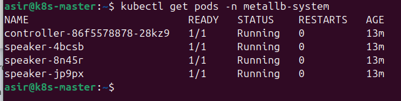
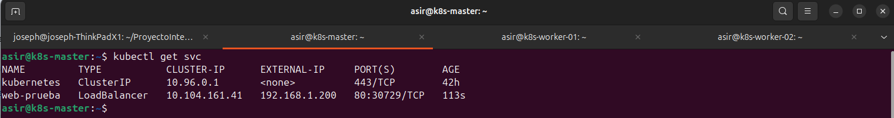

# ⚖️ Fase 4: Instalación y Configuración de MetalLB

<p align="center">
  
  
  
</p>

---

## 📖 1. Introducción
En entornos *Bare-Metal* o virtualizados con Proxmox, Kubernetes no incluye de forma nativa un balanceador de carga de red. Sin este componente, al crear un servicio de tipo `LoadBalancer`, el estado de la IP externa permanecerá en `<pending>` indefinidamente. 

**MetalLB** soluciona esta limitación proporcionando una implementación de red que asigna direcciones IP reales de nuestra red local a los servicios del clúster mediante el protocolo ARP (Capa 2).

---

## ⚙️ 2. Preparación: Modo Strict ARP
Para garantizar el correcto funcionamiento del balanceo en Capa 2, es necesario configurar el componente `kube-proxy` para que active el modo `strictARP`.

**1. Editar el ConfigMap de kube-proxy:**
```Bash
kubectl edit configmap -n kube-system kube-proxy
```

**2. Modificar el parámetro:**
Localiza el campo `strictARP` dentro del bloque `ipvs` y cámbialo a `true`:

```Yaml
ipvs:
  strictARP: true
```

**3. Guardar y salir:** (Pulsa `Esc` y escribe `:wq`).

---

## 📥 3. Instalación de MetalLB
Siguiendo la arquitectura de despliegue remoto de este proyecto, instalamos los componentes necesarios directamente desde el repositorio:

```Bash
kubectl apply -f https://raw.githubusercontent.com/jobopaK/ProyectoIntegradoASIR/main/kubernetes/manifests/metallb/metallb-native.yaml
```

> [!NOTE]
> Este comando despliega el controlador y los *speakers* necesarios en el namespace `metallb-system`.

### 🔍 3.1 Verificación de los Pods del Sistema
Antes de configurar el rango de IPs, confirmamos que el controlador principal y los *speakers* (uno por cada nodo del clúster) están funcionando correctamente.

```Bash
kubectl get pods -n metallb-system
```



Como se observa en la captura, disponemos del controlador y de tres *speakers* en estado `Running`, lo que confirma que el despliegue a través de los nodos ha sido un éxito.

---

## 🌐 4. Configuración del Rango de IPs

Definimos el segmento de red local que MetalLB gestionará para asignar a los servicios externos. Para este proyecto se ha reservado el rango: `192.168.1.200 - 192.168.1.250`.

Aplicamos la configuración del pool de direcciones y el anuncio L2:

```Bash
kubectl apply -f https://raw.githubusercontent.com/jobopaK/ProyectoIntegradoASIR/main/kubernetes/manifests/metallb/metallb-config.yaml
```

---

## ✅ 5. Verificación de Funcionamiento

Para validar que la infraestructura asigna IPs externas correctamente, se realiza un despliegue de prueba:

**1. Desplegar servidor web de prueba:**
```Bash
kubectl create deployment web-prueba --image=nginx
kubectl expose deployment web-prueba --port=80 --type=LoadBalancer
```

**2. Comprobar la asignación de IP:**
```Bash
kubectl get svc web-prueba
```

### 📊 Resultado de la Validación
Como se aprecia en la captura de pantalla de la terminal, MetalLB asigna automáticamente la IP `192.168.1.200` al servicio, permitiendo el acceso desde la red física:


    
> [!IMPORTANT]
> El servicio es ahora accesible desde cualquier host de la red local sin necesidad de configuraciones adicionales de enrutamiento.
    
---

## 🧹 6. Limpieza de Recursos

Una vez verificado el sistema, eliminamos el servicio de prueba para liberar los recursos del pool:

```Bash
kubectl delete service web-prueba
kubectl delete deployment web-prueba
```

> [!CAUTION]
> Es fundamental eliminar los servicios de prueba para que MetalLB libere la IP asignada (`192.168.1.200`) y la devuelva al pool de direcciones disponibles, dejándola libre para el Ingress Controller que instalaremos a continuación.

---
<p align="center">
  <b>Siguiente Paso:</b> <a href="./05.Instalar-Ingress-Controller-Nginx.md">Fase 5: Instalación de Ingress Controller (Nginx)</a><br><br>
  <b>Proyecto Integrado de Grado Superior ASIR</b><br>
  © 2026 - <a href="https://github.com/jobopaK">jobopaK</a>
</p>
