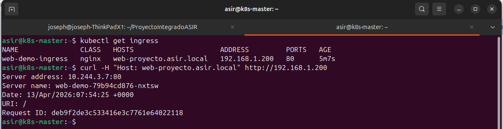
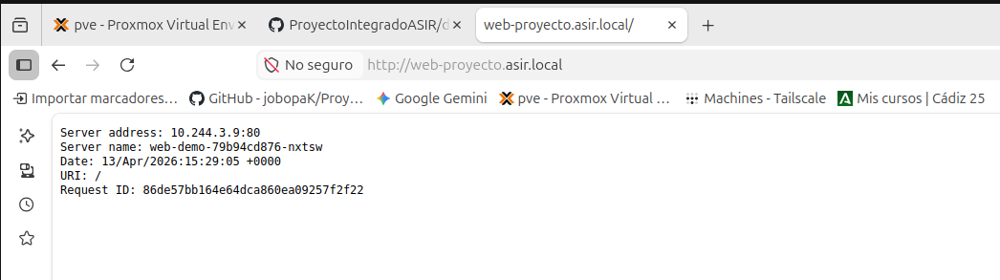
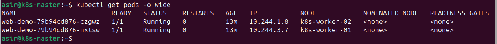
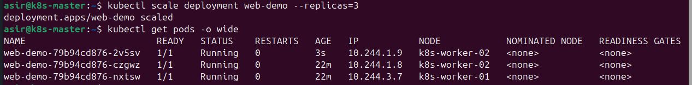

# 🌐 Fase 5: Instalación de Ingress Controller (Nginx)

<p align="center">
  
  
  
</p>

---

## 📖 1. Introducción
Tras configurar **MetalLB** para obtener IPs externas, el siguiente paso es gestionar el tráfico de **Capa 7 (HTTP/HTTPS)**. El **Ingress Controller** de Nginx actúa como un proxy inverso y balanceador de carga que permite dirigir el tráfico a diferentes servicios basándose en el nombre de dominio (*Host*) o la ruta (*Path*), utilizando una única dirección IP externa.

---

## 📥 2. Instalación del Controlador
Para mantener la consistencia con el despliegue remoto del proyecto, instalamos el controlador oficial de Nginx desde el repositorio de manifiestos:

```Bash
kubectl apply -f https://raw.githubusercontent.com/jobopaK/ProyectoIntegradoASIR/refs/heads/main/kubernetes/manifests/ingress/deploy.yaml
```

> [!IMPORTANT]
> Este comando crea el namespace `ingress-nginx` y despliega los componentes necesarios. MetalLB asignará automáticamente una IP del pool al servicio del controlador (en este caso, la **192.168.1.200**).

---

## 🚀 3. Despliegue de Aplicación de Prueba (Web-Demo)
Para validar el funcionamiento, desplegamos una aplicación que incluye un **Deployment** (con 2 réplicas iniciales), un **Service** y un recurso **Ingress**:

```Bash
kubectl apply -f https://raw.githubusercontent.com/jobopaK/ProyectoIntegradoASIR/refs/heads/main/kubernetes/manifests/apps/web-demo.yaml
```

> [!NOTE]
> **Gestión de limpieza:** Si necesitas eliminar este despliegue de prueba, puedes ejecutar:
> ```Bash
> kubectl delete -f https://raw.githubusercontent.com/jobopaK/ProyectoIntegradoASIR/refs/heads/main/kubernetes/manifests/apps/web-demo.yaml```

---

## 🛠️ 4. Configuración del Host Local
Debido a que usamos un dominio ficticio (`web-proyecto.asir.local`), debemos indicarle a nuestro equipo cliente dónde encontrarlo editando el archivo `hosts` (`/etc/hosts` en Linux o `C:\Windows\System32\drivers\etc\hosts` en Windows):

```Textplain
192.168.1.200  web-proyecto.asir.local
```

---

## ✅ 5. Verificación y Pruebas de Funcionamiento

### A. Comprobación del Recurso Ingress
Verificamos que el Ingress ha reconocido la clase `nginx` y ha vinculado el dominio a la IP de MetalLB:

```Bash
kubectl get ingress
```



Como se observa en la captura superior, el comando `curl -H "Host: web-proyecto.asir.local" http://192.168.1.200` simula la petición DNS desde el propio clúster, confirmando que el tráfico llega al pod correcto.

### B. Validación desde el Navegador (Red Física)
Una vez configurado el archivo `hosts`, podemos acceder a la URL desde cualquier navegador en la red física.



La captura confirma que el navegador resuelve `web-proyecto.asir.local`, el Ingress Controller recibe la petición y la deriva al pod `web-demo-79b94cd876-nxtsw` ubicado en la red interna de Kubernetes.

> [!NOTE]
> **Infraestructura Multi-Servicio:** El sistema es capaz de discriminar tráfico basado en nombres de dominio, permitiendo alojar múltiples servicios bajo una única dirección IP externa.
>
> 

### C. Distribución de Cargas entre Nodos
Kubernetes distribuye los pods entre los workers disponibles para garantizar alta disponibilidad.

```Bash
kubectl get pods -o wide
```



En la imagen se aprecia cómo el orquestador ha situado una réplica en `k8s-worker-02` y otra en `k8s-worker-01`.

---

## 📈 6. Escalabilidad del Servicio
Si aumentamos las réplicas, el Ingress Controller actualizará automáticamente su lista de destinos (*endpoints*):

```Bash
kubectl scale deployment web-demo --replicas=3
```



Tras el escalado, el sistema levanta instantáneamente un tercer pod, manteniendo la alta disponibilidad ante picos de tráfico.

---

## 🧠 7. Conceptos Clave

### 🌐 ¿Cómo puedo tener varias webs?
El Ingress Controller permite el **Virtual Hosting**. Para añadir una segunda web:
1. Crear un nuevo **Deployment** y **Service** para la nueva app.
2. Definir un nuevo **Ingress** con un `host` diferente (ej: `monitorizacion.asir.local`).
3. Apuntar ese nuevo nombre a la misma IP (**192.168.1.200**) en tu archivo `hosts`.

### 📦 ¿Por qué la web funciona sin un index.html?
Porque la imagen `nginxdemos/hello` ya contiene el servidor web y el código necesario empaquetado; Kubernetes simplemente "enciende" esa caja preconfigurada.

### 💾 ¿Qué sucede si apago el clúster?
La configuración es **persistente**. Al encender los nodos, el Master leerá el **Estado Deseado** en su base de datos y ordenará a los Workers levantar las réplicas automáticamente.

---
<p align="center">
  <b>Siguiente Paso:</b> <a href="./06.Servidor-NFS-y-Almacenamiento-Persistente.md">Fase 6: Servidor NFS y Almacenamiento Persistente</a><br><br>
  <b>Proyecto Integrado de Grado Superior ASIR</b><br>
  © 2026 - <a href="https://github.com/jobopaK">jobopaK</a>
</p>
