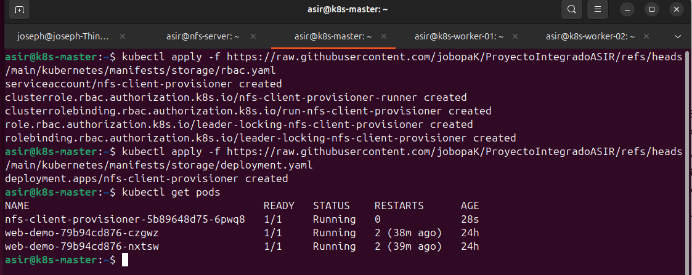
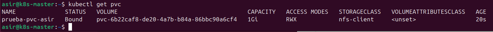

# 💾 Fase 6: Servidor NFS y Almacenamiento Persistente

<p align="center">
  
  
  
</p>

---

## 📖 1. Introducción
En un clúster de Kubernetes, los contenedores son efímeros por naturaleza: si un Pod se reinicia o se mueve de nodo, los datos guardados en su interior desaparecen. Para lograr una infraestructura de producción real, hemos implementado un sistema de **Almacenamiento Persistente** basado en un servidor **NFS (Network File System)** externo.

Este sistema permite que los datos sobrevivan a reinicios y que múltiples Pods accedan a la misma información simultáneamente mediante el modo de acceso **ReadWriteMany (RWX)**.

---

## 🖥️ 2. Creación y Configuración del Servidor NFS

Para mantener la eficiencia, no instalamos el sistema desde cero. En su lugar, **clonamos la VM** de nuestra plantilla base y aplicamos los parámetros específicos.

### A. Despliegue en Proxmox
1. **Clonar:** Haz clic derecho en `ubuntu-2404-template` -> **Clone** (Full Clone).
2. **Identidad:** Nombra la nueva VM como `nfs-server` con el ID `110`.
3. **Hardware y Red:** Ajusta la configuración según la siguiente tabla:

| Parámetro | Valor Sugerido |
| :--- | :--- |
| **CPU / RAM** | 1 Core / 1 GB RAM |
| **Hostname** | `nfs-server` |
| **IP Estática** | `192.168.1.116` |
| **Ruta en Servidor** | `/srv/nfs/kubedata` |
| **Exportación** | `192.168.1.0/24(rw,sync,no_subtree_check,no_root_squash)` |

### B. Configuración del Servicio NFS
Una vez arrancada la VM, instalamos el servicio y preparamos la carpeta compartida:

```Bash
sudo apt update && sudo apt install nfs-kernel-server -y
sudo mkdir -p /srv/nfs/kubedata
sudo chown nobody:nogroup /srv/nfs/kubedata
sudo chmod 777 /srv/nfs/kubedata
```

> [!IMPORTANT]
> El parámetro **`no_root_squash`** en `/etc/exports` es vital. Permite que el usuario *root* del contenedor escriba en el NFS con permisos de superusuario, algo imprescindible para el correcto funcionamiento de los servicios en K8s.

---

## 🛠️ 3. Preparación de los Nodos (Cliente NFS)

Para que Kubernetes pueda "montar" los discos de red, **todos** los nodos (Master y Workers) deben tener instalado el software cliente:

```Bash
sudo apt update && sudo apt install nfs-common -y
```

---

## 🚀 4. Despliegue del Aprovisionamiento Dinámico

En lugar de crear volúmenes manualmente, utilizamos un **NFS Subdir External Provisioner**. Este pod detecta cuando una aplicación pide disco y crea automáticamente la carpeta correspondiente en el servidor NFS.

### A. Permisos de Rol (RBAC) y Controlador
Aplicamos los permisos necesarios y el despliegue del controlador utilizando los manifiestos de nuestro repositorio:

```Bash
kubectl apply -f https://raw.githubusercontent.com/jobopaK/ProyectoIntegradoASIR/refs/heads/main/kubernetes/manifests/storage/rbac.yaml
kubectl apply -f https://raw.githubusercontent.com/jobopaK/ProyectoIntegradoASIR/refs/heads/main/kubernetes/manifests/storage/nfs-provisioner.yaml
```

### B. Verificación del Pod de Almacenamiento
Confirmamos que el "cerebro" del almacenamiento está operativo y en estado `Running`:

```Bash
kubectl get pods
```



Como se observa en la captura superior, el pod `nfs-client-provisioner` se encuentra en ejecución junto a los servicios de la web-demo.

---

## 📂 5. Clase de Almacenamiento (StorageClass)

Definimos la `StorageClass` para que los desarrolladores puedan solicitar espacio sin conocer los detalles técnicos del servidor NFS.

```Bash
kubectl apply -f https://raw.githubusercontent.com/jobopaK/ProyectoIntegradoASIR/refs/heads/main/kubernetes/manifests/storage/nfs-storageclass.yaml
```

---

## ✅ 6. Prueba de Persistencia (PVC Test)

Para validar que la infraestructura es capaz de auto-gestionar el disco, realizamos un **PersistentVolumeClaim (PVC)** de prueba denominado `prueba-pvc-asir`.

**1. Aplicar el reclamo de 1GB:**
```Bash
kubectl apply -f https://raw.githubusercontent.com/jobopaK/ProyectoIntegradoASIR/refs/heads/main/kubernetes/manifests/storage/test-pvc.yaml
```

**2. Comprobar el estado del volumen:**
```Bash
kubectl get pvc
```



> [!SUCCESS]
> El estado **`Bound`** (vinculado) confirma que el clúster ha reservado con éxito el espacio en la VM NFS, asignándole un volumen único de 1Gi con modo de acceso RWX.

---

## 🧠 7. Dudas Comunes y Troubleshooting

### ¿Por qué mi Pod se queda en `ContainerCreating`?
Suele ocurrir por dos motivos:
1.  **Falta de cliente:** Olvidaste instalar `nfs-common` en el Worker donde corre el Pod.
2.  **Firewall:** El puerto **2049** está cerrado en la VM NFS. Prueba con `sudo ufw disable` para descartar.

### ¿Qué pasa si borro un Pod?
Los datos **no se borran**. Al estar en un volumen persistente (`Bound`), cuando el Pod vuelva a nacer (incluso en otro nodo), se reconectará a la misma carpeta del NFS y recuperará sus archivos.

---
<p align="center">
  <b>Siguiente Paso:</b> <a href="./07.Automatización-con-Ansible.md">Fase 7: Automatización con Ansible</a><br><br>
  <b>Proyecto Integrado de Grado Superior ASIR</b><br>
  © 2026 - <a href="https://github.com/jobopaK">jobopaK</a>
</p>
