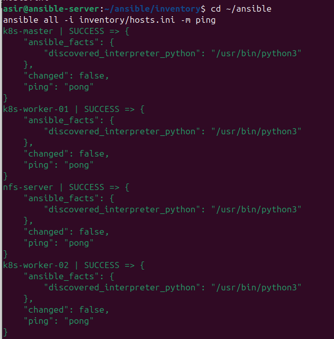
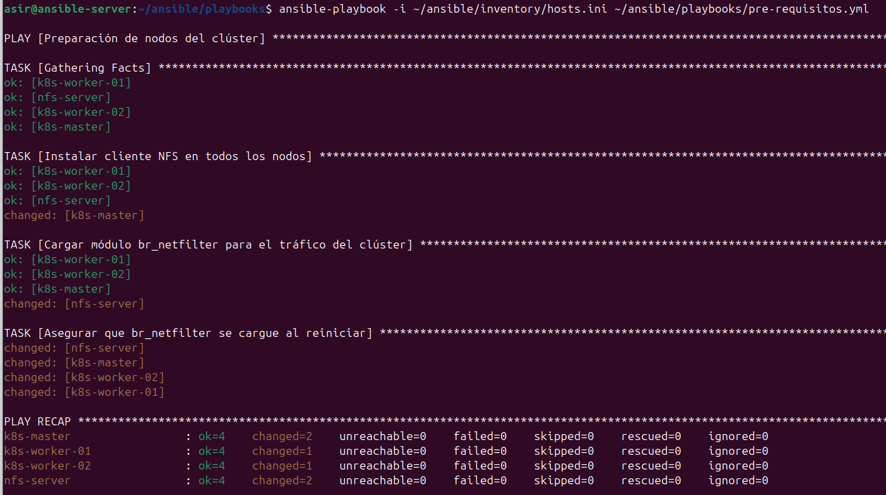

# 🤖 Fase 7: Automatización con Ansible (IaC)

<p align="center">
  
  
  
</p>

---

## 📖 1. Introducción
Para escalar el clúster de forma eficiente, hemos implementado **Infraestructura como Código (IaC)** mediante **Ansible**. Esto nos permite gestionar la configuración de todos los nodos de forma simultánea y centralizada desde un único "Nodo de Control", garantizando la idempotencia en todo el entorno.

---

## 🖥️ 2. Preparación del Nodo de Control

El servidor de control es el cerebro de la automatización. Para su despliegue, hemos clonado la plantilla base de Ubuntu 24.04 creada anteriormente en Proxmox.

**Pasos en Proxmox:**
1. **Clonar:** Clic derecho en `ubuntu-2404-template` -> **Clone** (Full Clone).
2. **Identidad:** Nombre de VM: `ansible-server` | VM ID: `115`.
3. **Configuración de Red:** Se asigna la IP estática `192.168.1.115` mediante Netplan.

| Parámetro | Valor Real |
| :--- | :--- |
| **Hostname** | `ansible-server` |
| **IP Estática** | `192.168.1.115` |
| **Máscara / Gateway** | `/24` | `192.168.1.1` |
| **Recursos** | 1 Core / 1 GB RAM / 40 GB Disco |

**Instalación del motor de automatización:**
```Bash
sudo apt update && sudo apt install ansible -y
```

---

## 🔑 3. Intercambio de Llaves SSH (Confianza)

Ansible se conecta a los nodos mediante SSH. Para que el proceso sea automático, el servidor debe poder entrar en los nodos sin pedir contraseña en cada ejecución.

**1. Generar par de llaves en `ansible-server`:**

```Bash
ssh-keygen -t rsa -b 4096
# Pulsar ENTER en todas las opciones (dejar la "passphrase" vacía)
```

**2. Copiar la llave pública a todos los nodos:**
Es fundamental documentar que, al ejecutar estos comandos por primera vez, el sistema pedirá confirmar la autenticidad del nodo escribiendo **yes** y luego la contraseña del usuario **asir** de forma manual:

```Bash
ssh-copy-id asir@192.168.1.110   # Nodo Master
ssh-copy-id asir@192.168.1.111   # Nodo Worker 01
ssh-copy-id asir@192.168.1.112   # Nodo Worker 02
ssh-copy-id asir@192.168.1.116   # Nodo Servidor NFS
```

> [!TIP]
> Una vez completado, puedes verificar el acceso con `ssh asir@192.168.1.110`. Si entras directamente al terminal del nodo sin que te pida contraseña, el intercambio ha sido exitoso.

---

## 📂 4. Estructura del Proyecto e Inventario

Para mantener un estándar profesional, el proyecto se organiza en subcarpetas específicas. Esto facilita el crecimiento del clúster y la gestión de diferentes configuraciones.

### Opción A: Configuración Manual
Recomendado para entender la lógica de grupos en Ansible.

```Bash
mkdir -p ~/ansible/inventory ~/ansible/playbooks ~/ansible/roles
cd ~/ansible/inventory
nano hosts.ini
```

**Contenido del archivo `hosts.ini`:**

```Ini
[master]
k8s-master ansible_host=192.168.1.110

[workers]
k8s-worker-01 ansible_host=192.168.1.111
k8s-worker-02 ansible_host=192.168.1.112

[nfs]
nfs-server ansible_host=192.168.1.116

[k8s_cluster:children]
master
workers
```

### Opción B: Descarga desde Repositorio (Rápida)
Ideal para replicar el entorno exactamente como está en el repositorio de GitHub.

```Bash
# 1. Crear carpetas base
mkdir -p ~/ansible/inventory ~/ansible/playbooks

# 2. Descargar archivos reales
wget -O ~/ansible/inventory/hosts.ini https://raw.githubusercontent.com/jobopaK/ProyectoIntegradoASIR/main/ansible/inventory/hosts.ini
wget -O ~/ansible/playbooks/pre-requisitos.yml https://raw.githubusercontent.com/jobopaK/ProyectoIntegradoASIR/main/ansible/playbooks/pre-requisitos.yml
```

---

## 🛡️ 5. El Desafío del Sudo (Escalada de Privilegios)

Al ejecutar tareas de administración (como instalar paquetes), Ansible requiere privilegios de `root` mediante el uso de `become: yes`. Por defecto, Ubuntu solicita la contraseña de usuario para cada acción de `sudo`, lo que detiene la automatización con el error `Missing sudo password`.

**Solución Implementada:**
Para lograr una automatización fluida, hemos configurado los nodos para que el usuario `asir` pueda ejecutar comandos administrativos sin necesidad de introducir la contraseña.

**Comando aplicado en cada nodo:**

```Bash
echo "asir ALL=(ALL) NOPASSWD: ALL" | sudo tee /etc/sudoers.d/asir
```

> [!IMPORTANT]
> **Decisión de Diseño:** Esta configuración se ha aplicado directamente en la **Plantilla Base de Proxmox**. De esta forma, cualquier nodo futuro (como un posible Worker-03) nacerá ya preparado para ser gestionado por Ansible de forma 100% automática, eliminando la intervención manual en el escalado del clúster.

---

## 📜 6. Verificación y Ejecución de Playbooks

Con la confianza SSH establecida y los privilegios de `sudo` configurados, procedemos a realizar las pruebas finales de control.

### 6.1 Prueba de Conectividad (Ping)
Primero, validamos que el servidor de control puede comunicarse con todos los nodos del inventario y ejecutar Python en ellos:

```Bash
cd ~/ansible
ansible all -i inventory/hosts.ini -m ping
```



> [!NOTE]
> Si el resultado muestra **SUCCESS** en verde para todos los nodos, significa que la infraestructura está lista para ser gestionada por código.

### 6.2 Ejecución del Playbook de Pre-requisitos
Lanzamos el script `pre-requisitos.yml` para automatizar la instalación de componentes esenciales (cliente NFS y módulos del kernel) en todo el clúster de forma simultánea:

```Bash
ansible-playbook -i inventory/hosts.ini playbooks/pre-requisitos.yml
```



**Análisis de los resultados:**
* **ok**: La tarea ya estaba cumplida en el nodo (no se requirió intervención).
* **changed**: Ansible detectó que el nodo no cumplía el requisito y lo configuró automáticamente.

---
<p align="center">
  <b>Siguiente Paso:</b> <a href="./08.Despliegue-de-Aplicación-Real-y-Dockerfile.md">Fase 8: Despliegue de Aplicación Real</a><br><br>
  <b>Proyecto Integrado de Grado Superior ASIR</b><br>
  © 2026 - <a href="https://github.com/jobopaK">jobopaK</a>
</p>
