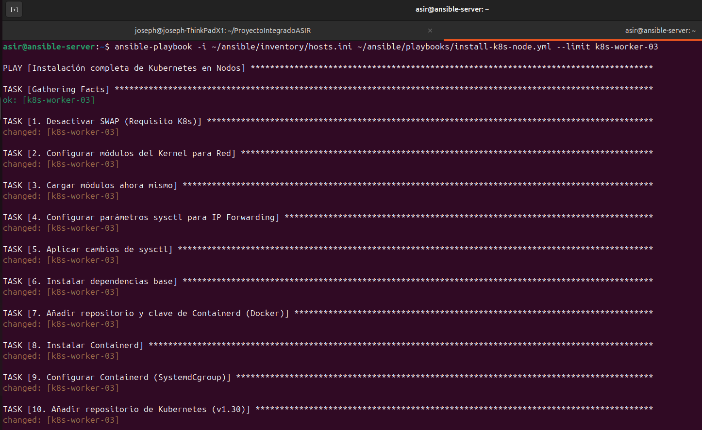
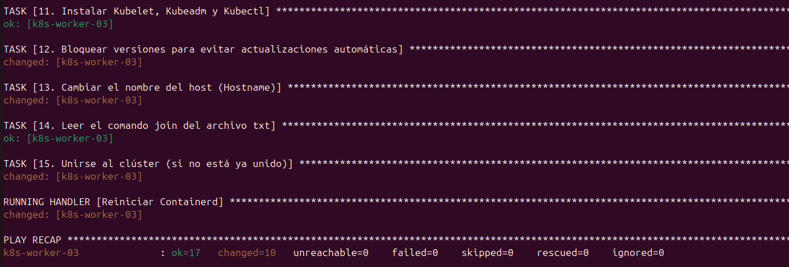

# 🤖 Fase 7: Automatización con Ansible (IaC)

<p align="center">
  
  
  
</p>

---

## 📖 1. Introducción
Para escalar el clúster de forma eficiente, hemos implementado **Infraestructura como Código (IaC)** mediante **Ansible**. Esto nos permite gestionar la configuración de todos los nodos de forma simultánea y centralizada desde un único "Nodo de Control", garantizando la idempotencia en todo el entorno.

---

## 🖥️ 2. Preparación del Nodo de Control

El servidor de control es el cerebro de la automatización. Para su despliegue, hemos clonado la plantilla base de Ubuntu 24.04 creada anteriormente en Proxmox.

**Pasos en Proxmox:**
1. **Clonar:** Clic derecho en `ubuntu-2404-template` -> **Clone** (Full Clone).
2. **Identidad:** Nombre de VM: `ansible-server` | VM ID: `115`.
3. **Configuración de Red:** Se asigna la IP estática `192.168.1.115` mediante Netplan.

| Parámetro | Valor Real |
| :--- | :--- |
| **Hostname** | `ansible-server` |
| **IP Estática** | `192.168.1.115` |
| **Máscara / Gateway** | `/24` | `192.168.1.1` |
| **Recursos** | 1 Core / 1 GB RAM / 40 GB Disco |

**Instalación del motor de automatización:**
```Bash
sudo apt update && sudo apt install ansible -y
```

---

## 🔑 3. Intercambio de Llaves SSH (Confianza)

Ansible se conecta a los nodos mediante SSH. Para que el proceso sea automático, el servidor debe poder entrar en los nodos sin pedir contraseña en cada ejecución.

**1. Generar par de llaves en `ansible-server`:**

```Bash
ssh-keygen -t rsa -b 4096
# Pulsar ENTER en todas las opciones (dejar la "passphrase" vacía)
```

**2. Copiar la llave pública a todos los nodos:**
Es fundamental documentar que, al ejecutar estos comandos por primera vez, el sistema pedirá confirmar la autenticidad del nodo escribiendo **yes** y luego la contraseña del usuario **asir** de forma manual:

```Bash
ssh-copy-id asir@192.168.1.110   # Nodo Master
ssh-copy-id asir@192.168.1.111   # Nodo Worker 01
ssh-copy-id asir@192.168.1.112   # Nodo Worker 02
ssh-copy-id asir@192.168.1.116   # Nodo Servidor NFS
```

> [!TIP]
> Una vez completado, puedes verificar el acceso con `ssh asir@192.168.1.110`. Si entras directamente al terminal del nodo sin que te pida contraseña, el intercambio ha sido exitoso.

---

## 📂 4. Estructura del Proyecto e Inventario

Para mantener un estándar profesional, el proyecto se organiza en subcarpetas específicas. Esto facilita el crecimiento del clúster y la gestión de diferentes configuraciones.

### Opción A: Configuración Manual
Recomendado para entender la lógica de grupos en Ansible.

```Bash
mkdir -p ~/ansible/inventory ~/ansible/playbooks ~/ansible/roles
nano ~/ansible/inventory/hosts.ini
```

**Contenido del archivo `hosts.ini`:**

```Ini
[master]
k8s-master ansible_host=192.168.1.110

[workers]
k8s-worker-01 ansible_host=192.168.1.111
k8s-worker-02 ansible_host=192.168.1.112

[nfs]
nfs-server ansible_host=192.168.1.116

[k8s_cluster:children]
master
workers
```

### Opción B: Descarga desde Repositorio (Rápida)
Ideal para replicar el entorno exactamente como está en el repositorio de GitHub.

```Bash
# 1. Crear carpetas base
mkdir -p ~/ansible/inventory ~/ansible/playbooks

# 2. Descargar archivos reales
wget -O ~/ansible/inventory/hosts.ini https://raw.githubusercontent.com/jobopaK/ProyectoIntegradoASIR/main/ansible/inventory/hosts.ini
wget -O ~/ansible/playbooks/pre-requisitos.yml https://raw.githubusercontent.com/jobopaK/ProyectoIntegradoASIR/main/ansible/playbooks/pre-requisitos.yml
```

---

## 🛡️ 5. El Desafío del Sudo (Escalada de Privilegios)

Al ejecutar tareas de administración (como instalar paquetes), Ansible requiere privilegios de `root` mediante el uso de `become: yes`. Por defecto, Ubuntu solicita la contraseña de usuario para cada acción de `sudo`, lo que detiene la automatización con el error `Missing sudo password`.

**Solución Implementada:**
Para lograr una automatización fluida, hemos configurado los nodos para que el usuario `asir` pueda ejecutar comandos administrativos sin necesidad de introducir la contraseña.

**Comando aplicado en cada nodo:**

```Bash
echo "asir ALL=(ALL) NOPASSWD: ALL" | sudo tee /etc/sudoers.d/asir
```

> [!IMPORTANT]
> **Decisión de Diseño:** Esta configuración se ha aplicado directamente en la **Plantilla Base de Proxmox**. De esta forma, cualquier nodo futuro (como un posible Worker-03) nacerá ya preparado para ser gestionado por Ansible de forma 100% automática, eliminando la intervención manual en el escalado del clúster.

> [!NOTE]
> **Consideración de Seguridad:** Se ha optado por la directiva `NOPASSWD` exclusivamente para el usuario `asir` y limitada al entorno de administración automatizada. Esta decisión de diseño prioriza la fluidez del despliegue continuo (CI/CD) y la escalabilidad del clúster sobre la re-autenticación manual, manteniendo un control de acceso estricto mediante llaves SSH.

---

## 📜 6. Verificación y Ejecución de Playbooks

Con la confianza SSH establecida y los privilegios de `sudo` configurados, procedemos a realizar las pruebas finales de control.

### 6.1 Prueba de Conectividad (Ping)
Primero, validamos que el servidor de control puede comunicarse con todos los nodos del inventario y ejecutar Python en ellos:

```Bash
ansible all -i ~/ansible/inventory/hosts.ini -m ping
```


> [!NOTE]
> Si el resultado muestra **SUCCESS** en verde para todos los nodos, significa que la infraestructura está lista para ser gestionada por código.

### 6.2 Ejecución del Playbook de Pre-requisitos
Lanzamos el script `pre-requisitos.yml` para automatizar la instalación de componentes esenciales (cliente NFS y módulos del kernel) en todo el clúster de forma simultánea:

```Bash
ansible-playbook -i ~/ansible/inventory/hosts.ini ~/ansible/playbooks/pre-requisitos.yml
```


**Análisis de los resultados:**
* **ok**: La tarea ya estaba cumplida en el nodo (no se requirió intervención).
* **changed**: Ansible detectó que el nodo no cumplía el requisito y lo configuró automáticamente.

---

## 🚀 7. Escalabilidad Horizontal: Despliegue del Worker 03

Una de las mayores ventajas de esta arquitectura es la facilidad para añadir nuevos nodos. Para el **k8s-worker-03**, seguimos un proceso híbrido que combina la rapidez de la plantilla de Proxmox con la potencia de Ansible.

### 7.1 Preparación Inicial (Manual)
Debido a que Ansible necesita una IP para comunicarse, realizamos un mínimo de pasos manuales:
1. **Clonación:** Clonar la `ubuntu-2404-template` en Proxmox (VM ID 113).
2. **Red:** Iniciar la VM y configurar manualmente la IP estática `192.168.1.113`.
3. **Inventario:** Añadir el nuevo nodo al archivo `~/ansible/inventory/hosts.ini` dentro de la VM **ansible-server**:

```Ini
[workers]
k8s-worker-01 ansible_host=192.168.1.111
k8s-worker-02 ansible_host=192.168.1.112
k8s-worker-03 ansible_host=192.168.1.113
```

### 7.2 Intercambio de Llaves (Opciones)
Para que el Nodo de Control pueda gestionar el nuevo worker, existen dos vías:
* **Opción A (Directa):** Ejecutar `ssh-copy-id asir@192.168.1.113` desde el servidor Ansible.
* **Opción B (Proactiva):** Actualizar la plantilla de Proxmox incluyendo la llave pública del servidor Ansible en el archivo `~/.ssh/authorized_keys`. De esta forma, cualquier clon futuro tendrá acceso automático. Ejecutando `ssh-copy-id asir@192.168.1.XXX` desde el servidor Ansible a la IP asignada de la plantilla.

---

## 📜 8. El "Super Playbook" de Instalación Completa

Para automatizar la conversión de una VM vacía en un nodo de Kubernetes, hemos desarrollado el playbook `install-k8s-node.yml`. Este script garantiza que todos los nodos tengan exactamente la misma configuración y versiones de software y parámetros de red, eliminando el error humano.

### Opción A: Configuración Manual (en "ansible-server")
Recomendado si se desea editar o revisar el código antes de su ejecución.

```Bash
nano ~/ansible/playbooks/install-k8s-node.yml
```

**Código completo del Playbook:**

```yaml
---
- name: Instalación completa de Kubernetes en Nodos
  hosts: workers
  become: yes
  tasks:
    - name: 1. Desactivar SWAP (Requisito K8s)
      shell: |
        swapoff -a
        sed -i '/ swap / s/^\(.*\)$/#\1/g' /etc/fstab

    - name: 2. Configurar módulos del Kernel para Red
      copy:
        dest: /etc/modules-load.d/k8s.conf
        content: |
          overlay
          br_netfilter

    - name: 3. Cargar módulos ahora mismo
      shell: |
        modprobe overlay
        modprobe br_netfilter

    - name: 4. Configurar parámetros sysctl para IP Forwarding
      copy:
        dest: /etc/sysctl.d/k8s.conf
        content: |
          net.bridge.bridge-nf-call-iptables  = 1
          net.bridge.bridge-nf-call-ip6tables = 1
          net.ipv4.ip_forward                 = 1

    - name: 5. Aplicar cambios de sysctl
      command: sysctl --system

    - name: 6. Instalar dependencias base
      apt:
        name: [apt-transport-https, ca-certificates, curl, gpg]
        state: present
        update_cache: yes

    - name: 7. Añadir repositorio y clave de Containerd (Docker)
      shell: |
        install -m 0755 -d /etc/apt/keyrings
        curl -fsSL [https://download.docker.com/linux/ubuntu/gpg](https://download.docker.com/linux/ubuntu/gpg) | gpg --dearmor -o /etc/apt/keyrings/docker.gpg --yes
        echo "deb [arch=$(dpkg --print-architecture) signed-by=/etc/apt/keyrings/docker.gpg] [https://download.docker.com/linux/ubuntu](https://download.docker.com/linux/ubuntu) $(lsb_release -cs) stable" | tee /etc/apt/sources.list.d/docker.list > /dev/null

    - name: 8. Instalar Containerd
      apt:
        name: containerd.io
        state: present
        update_cache: yes

    - name: 9. Configurar Containerd (SystemdCgroup)
      shell: |
        mkdir -p /etc/containerd
        containerd config default | tee /etc/containerd/config.toml
        sed -i 's/SystemdCgroup = false/SystemdCgroup = true/g' /etc/containerd/config.toml
      notify: Reiniciar Containerd

    - name: 10. Añadir repositorio de Kubernetes (v1.30)
      shell: |
        curl -fsSL [https://pkgs.k8s.io/core:/stable:/v1.30/deb/Release.key](https://pkgs.k8s.io/core:/stable:/v1.30/deb/Release.key) | gpg --dearmor -o /etc/apt/keyrings/kubernetes-apt-keyring.gpg --yes
        echo 'deb [signed-by=/etc/apt/keyrings/kubernetes-apt-keyring.gpg] [https://pkgs.k8s.io/core:/stable:/v1.30/deb/](https://pkgs.k8s.io/core:/stable:/v1.30/deb/) /' | tee /etc/apt/sources.list.d/kubernetes.list

    - name: 11. Instalar Kubelet, Kubeadm y Kubectl
      apt:
        name: [kubelet, kubeadm, kubectl]
        state: present
        update_cache: yes

    - name: 12. Bloquear versiones para evitar actualizaciones automáticas
      shell: apt-mark hold kubelet kubeadm kubectl

    - name: 13. Cambiar el nombre del host (Hostname)
      hostname:
        name: "{{ inventory_hostname }}"

    - name: 14. Leer el comando join del archivo txt
      set_fact:
        join_command: "{{ lookup('file', '~/ansible/token_k8s.txt') }}"

    - name: 15. Unirse al clúster (si no está ya unido)
      shell: "{{ join_command }}"
      args:
        creates: /etc/kubernetes/kubelet.conf

  handlers:
    - name: Reiniciar Containerd
      service:
        name: containerd
        state: restarted
```

### Opción B: Descarga desde Repositorio (Rápida)

Ideal para asegurar que se utiliza la versión testeada del proyecto alojada en GitHub.

```Bash
wget -O ~/ansible/playbooks/install-k8s-node.yml https://raw.githubusercontent.com/jobopaK/ProyectoIntegradoASIR/main/ansible/playbooks/install-k8s-node.yml
```

> [!TIP]
> **Eficiencia en el diseño:** El uso de la variable mágica `{{ inventory_hostname }}` (Tarea 13) es una de las mayores potencias de este Playbook. Permite que el código sea genérico: Ansible toma el nombre definido en el archivo de inventario (`hosts.ini`) y lo aplica dinámicamente al sistema operativo, eliminando la necesidad de crear configuraciones específicas para cada nuevo nodo.

---

## ⚠️ 9. Gestión de Tokens y Errores Comunes

Durante el despliegue del Worker 03, nos enfrentamos a un problema común: el comando de unión fallaba a pesar de que Ansible no reportaba errores críticos.

### 9.1 El Problema: Token Caducado
Por seguridad, los tokens de unión generados por Kubernetes tienen una validez de **24 horas**. Al intentar unir un nodo 9 días después de la creación del clúster, el token almacenado en nuestro archivo `.txt` era inválido.

### 9.2 La Solución: Generar nuevo Token
Para solucionar esto, ejecutamos el siguiente comando en el **Nodo Master**:

```Bash
sudo kubeadm token create --print-join-command
```

Este comando genera una nueva cadena de unión que debemos actualizar en nuestro servidor de control **ansible-server**:

```Bash
nano ~/ansible/token_k8s.txt
```
Ya solo queda reemplazar el contenido por el nuevo comando generado.

### 9.3 Limpieza de intentos fallidos
Si un nodo intenta unirse y falla, deja residuos de configuración que impiden un segundo intento. Para limpiar el estado del nodo antes de reintentar el Playbook, usamos:

```Bash
sudo kubeadm reset -f
```

---

## ✅ 10. Despliegue Final y Verificación

Con el token actualizado y el inventario listo, lanzamos el despliegue limitando la ejecución únicamente al nuevo nodo para optimizar tiempo:

```Bash
ansible-playbook -i ~/ansible/inventory/hosts.ini ~/ansible/playbooks/install-k8s-node.yml --limit k8s-worker-03
```


*Figura 20: Proceso de configuración de dependencias y sistema en el nuevo nodo.*


*Figura 21: Finalización del despliegue indicando el éxito de la unión al clúster.*

### 10.1 Verificación Ad-Hoc desde el Nodo de Control
Antes de validar la unión en el clúster, podemos demostrar el poder de gestión centralizada de Ansible verificando el estado del servicio de Kubernetes en todos los nodos del grupo `workers` a la vez:

```Bash
ansible workers -i ~/ansible/inventory/hosts.ini -m shell -a "systemctl status kubelet | grep Active"
```

Este comando confirma en una sola salida que el demonio `kubelet` está corriendo correctamente en toda la infraestructura.

### 10.2 Verificación en el Master
Una vez finalizado el Playbook (RECAP: `failed=0`), verificamos que el nodo aparece en el clúster desde el **k8s-master**:

```Bash
kubectl get nodes
```

> [!NOTE]
> El nodo puede aparecer inicialmente como `NotReady` mientras se descargan e inician los pods de red (Calico/Flannel). Tras un par de minutos, el estado cambiará a `Ready`, confirmando el éxito de la automatización.

### 10.3 Asignación de Roles (Opcional)
Al añadir un nodo mediante `kubeadm join`, Kubernetes no le asigna automáticamente el rol de "worker" en la columna **ROLES**. Aunque esto no afecta al funcionamiento técnico, es una buena práctica para la organización del clúster.

Para asignar el rol al nuevo nodo desde el **k8s-master**, ejecutamos:

```Bash
kubectl label node k8s-worker-03 node-role.kubernetes.io/worker=worker
```

---
<p align="center">
  <b>Siguiente Paso:</b> <a href="./08.Despliegue-de-Aplicación-Real-y-Dockerfile.md">Fase 8: Despliegue de Aplicación Real</a><br><br>
  <b>Proyecto Integrado de Grado Superior ASIR</b><br>
  © 2026 - <a href="https://github.com/jobopaK">jobopaK</a>
</p>
