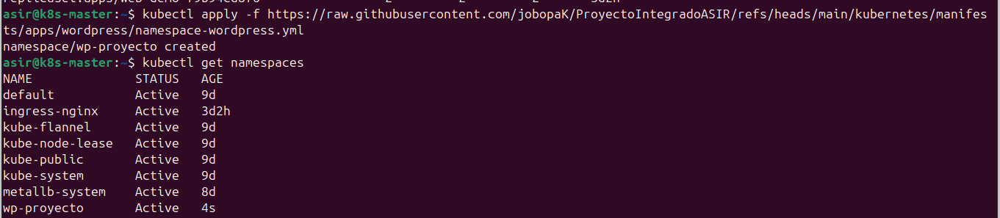
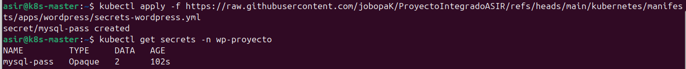
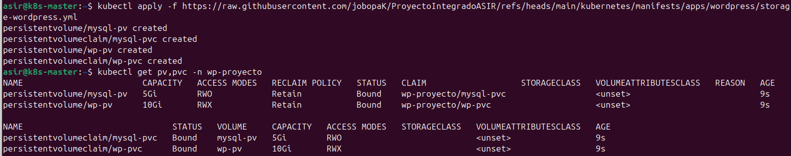
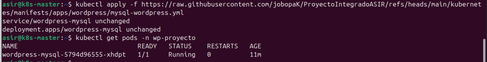
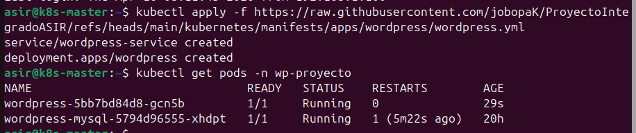
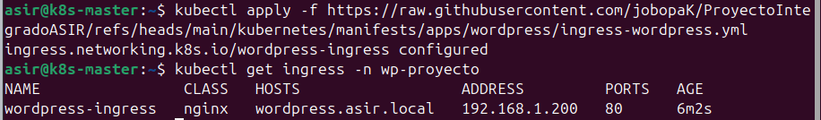
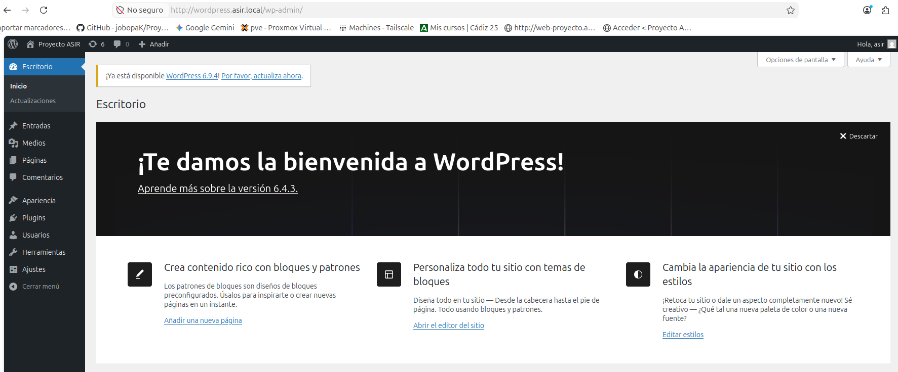

# 🌐 Fase 8: Despliegue de Aplicación Real (WordPress)

<p align="center">
  
  
  
</p>

---

## 📖 1. Introducción
Tras haber preparado nuestra infraestructura con almacenamiento persistente y gestión automatizada, ha llegado el momento de desplegar una aplicación real de arquitectura **Stateful** (con estado). 

En esta fase vamos a desplegar un **WordPress** respaldado por una base de datos **MySQL**. Para garantizar la Alta Disponibilidad (HA) y que los datos no se pierdan si los contenedores se destruyen, conectaremos ambos servicios a nuestro servidor NFS. Finalmente, expondremos la web al exterior utilizando nuestro Ingress Controller.

---

## 📦 2. Creación del Namespace

En Kubernetes, es una buena práctica agrupar los recursos de un mismo proyecto en un entorno aislado llamado **Namespace** para no mezclar configuraciones.

Ejecutamos el siguiente comando para crear el namespace `wp-proyecto` directamente desde nuestro repositorio:

```Bash
kubectl apply -f https://raw.githubusercontent.com/jobopaK/ProyectoIntegradoASIR/refs/heads/main/kubernetes/manifests/apps/wordpress/namespace-wordpress.yml
```

Para verificar que se ha creado correctamente, listamos todos los namespaces del clúster:

```Bash
kubectl get namespaces
```



> [!IMPORTANT]
> A partir de ahora, como nuestros recursos vivirán en este "cajón", debemos añadir la etiqueta `-n wp-proyecto` al final de cualquier comando para que Kubernetes sepa dónde buscar.

---

## 🔐 3. Configuración de Secretos (Passwords)

Nunca debemos exponer contraseñas en texto plano. Utilizamos el recurso **Secret** de Kubernetes para inyectar de forma segura la contraseña *root* y la del usuario de nuestra base de datos MySQL.

```Bash
kubectl apply -f https://raw.githubusercontent.com/jobopaK/ProyectoIntegradoASIR/refs/heads/main/kubernetes/manifests/apps/wordpress/secrets-wordpress.yml
```

Comprobamos que el secreto se ha generado correctamente:

```Bash
kubectl get secrets -n wp-proyecto
```



---

## 💾 4. Almacenamiento Persistente (PV y PVC)

Para que los datos sobrevivan a reinicios de los Pods, creamos Volúmenes Persistentes (PV) y "Peticiones de Volumen" (PVC) enlazados a nuestro servidor NFS.

```Bash
kubectl apply -f https://raw.githubusercontent.com/jobopaK/ProyectoIntegradoASIR/refs/heads/main/kubernetes/manifests/apps/wordpress/storage-wordpress.yml
```

Verificamos que Kubernetes ha conseguido enlazar el almacenamiento con el servidor físico NFS:

```Bash
kubectl get pv,pvc -n wp-proyecto
```

> [!NOTE]
> El estado **`Bound`** confirma que la reclamación de espacio ha sido un éxito.



---

## 🗄️ 5. Despliegue de la Base de Datos (MySQL)

Lanzamos el motor de base de datos. Este manifiesto crea el Deployment (los Pods) y el Service (el puente de red interno) para que WordPress pueda comunicarse con MySQL.

```Bash
kubectl apply -f https://raw.githubusercontent.com/jobopaK/ProyectoIntegradoASIR/refs/heads/main/kubernetes/manifests/apps/wordpress/mysql-wordpress.yml
```

Esperamos unos segundos y verificamos que el Pod de MySQL está corriendo (`Running`):

```Bash
kubectl get pods -n wp-proyecto
```



---

## 🖥️ 6. Despliegue del Frontend (WordPress)

Desplegamos el contenedor de WordPress. Este utilizará la base de datos previa y guardará los archivos (temas, imágenes) directamente en el NFS montado en la ruta `/var/www/html`.

```Bash
kubectl apply -f https://raw.githubusercontent.com/jobopaK/ProyectoIntegradoASIR/refs/heads/main/kubernetes/manifests/apps/wordpress/wordpress.yml
```

Comprobamos que ambos pods están vivos y completamente listos (`1/1`):

```Bash
kubectl get pods -n wp-proyecto
```



---

## 🌍 7. Exponer la web al exterior (Ingress)

Aunque la web funciona, está aislada en la red interna del clúster. Configuramos una regla de Ingress para conectar el exterior con el servicio mediante un nombre de dominio amigable.

```Bash
kubectl apply -f https://raw.githubusercontent.com/jobopaK/ProyectoIntegradoASIR/refs/heads/main/kubernetes/manifests/apps/wordpress/ingress-wordpress.yml
```

Revisamos que el Ingress Controller ha asignado la IP correcta (proveída por MetalLB) a nuestro dominio `wordpress.asir.local`:

```Bash
kubectl get ingress -n wp-proyecto
```



---

## 🛠️ 8. Troubleshooting: Permisos NFS y Error 502

Al usar volúmenes compartidos NFS, es común enfrentarse a problemas de permisos o errores "502 Bad Gateway". Esto ocurre porque el usuario interno del contenedor Apache (`www-data`, ID 33) no tiene permisos de escritura sobre la carpeta creada como root en nuestro servidor NFS físico.

### Solución aplicada
**1. En el Servidor NFS (Consola física/SSH a la VM de NFS):**
Cedemos la propiedad de la carpeta al usuario web:
```Bash
sudo chown -R 33:33 /srv/nfs/wp-data
sudo chmod -R 775 /srv/nfs/wp-data
```

**2. En el Nodo Master de Kubernetes:**
Forzamos a Kubernetes a destruir el Pod actual para que genere uno nuevo que ya reconocerá los permisos correctos:

Primero obtenemos el nombre exacto del Pod:
```Bash
kubectl get pods -n wp-proyecto
```
*(Copiamos el nombre que empiece por `wordpress-`, por ejemplo: `wordpress-5bb7bd84d8-gcn5b`)*

Lo eliminamos:
```Bash
kubectl delete pod wordpress-TU-ID-AQUI -n wp-proyecto
```

---

## 🚀 9. Acceso al Panel de Control

Para engañar a nuestro navegador y que sepa traducir el dominio `wordpress.asir.local` a la IP de nuestro Ingress, debemos editar el archivo `hosts` en nuestro equipo de trabajo personal (el portátil).

**En Linux:**
```Bash
sudo nano /etc/hosts
```

Añadimos la línea con la IP que nos devolvió el Ingress en el Paso 7:
```Textplain
192.168.1.200   wordpress.asir.local
```

Finalmente, introducimos `http://wordpress.asir.local` en nuestro navegador. Nos recibirá el instalador de WordPress, demostrando que la persistencia, la red y los contenedores trabajan en perfecta sintonía.



---
<p align="center">
  <b>Siguiente Paso:</b> <a href="./09.Monitorizacion-y-Backups.md">Fase 9: Monitorización y Backups</a><br><br>
  <b>Proyecto Integrado de Grado Superior ASIR</b><br>
  © 2026 - <a href="https://github.com/jobopaK">jobopaK</a>
</p>
