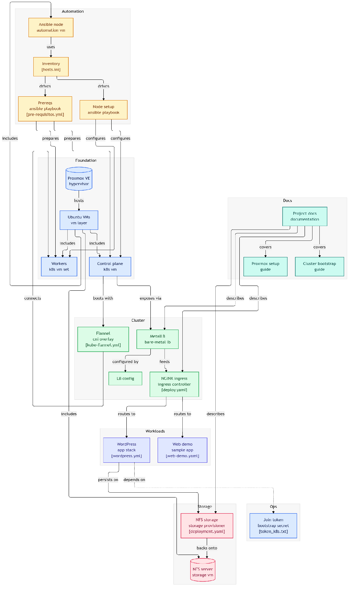

# **Diseño del Proyecto: Infraestructura de Alta Disponibilidad y Orquestación de Contenedores con Kubernetes sobre Proxmox**

  
  
  

📋 <strong>Tabla de Contenidos (Haz clic para desplegar)</strong>

 

<ul>
  <li><a href="#1-objetivos">🎯 1. Objetivos</a></li>
  <li><a href="#2-arquitectura-del-sistema">🏗️ 2. Arquitectura del Sistema</a></li>
  <li><a href="#3-diagrama-red--servidores">📊 3. Diagrama (Red / Servidores)</a></li>
  <li><a href="#4-plan-de-trabajo">📋 4. Plan de Trabajo</a></li>
</ul>

---

## 🎯 **1\. Objetivos**

El objetivo principal de este proyecto es diseñar, implementar y documentar una **infraestructura *on-premise* virtualizada y de alta disponibilidad**, capaz de orquestar servicios contenerizados mediante Kubernetes sobre un hipervisor Proxmox. Se busca resolver las problemáticas comunes de los sistemas monolíticos, como los tiempos de inactividad por fallos de hardware y los altos costes del escalado vertical, ofreciendo una solución moderna orientada a microservicios.

Para alcanzar este fin, se han establecido los siguientes **objetivos específicos**, los cuales abarcan desde la configuración física hasta la capa de aplicación:

* **Virtualización robusta:** Configurar Proxmox VE como hipervisor base, permitiendo una gestión flexible de los recursos físicos frente a alternativas propietarias.  
* **Orquestación de contenedores:** Desplegar un clúster de Kubernetes v1.30 (compuesto por 1 nodo Master y 2 Workers) utilizando `containerd` como entorno de ejecución (*runtime*).  
* **Resolución avanzada de red (Networking):** Optimizar la red del clúster resolviendo conflictos específicos del despliegue en entornos *bare-metal* (servidores físicos/locales). Esto incluye la desactivación de IPv6 a nivel de kernel para evitar latencias, y la correcta gestión de los Cgroups del sistema utilizando `systemd`.  
* **Gestión de tráfico externo e interno:** Implementar MetalLB para proveer balanceo de carga en Capa 2 (L2), asignando dinámicamente IPs locales a los servicios. A esto se le suma Nginx Ingress Controller para el enrutamiento de Capa 7 (L7), permitiendo el acceso a las aplicaciones mediante nombres de dominio.  
* **Almacenamiento persistente desacoplado:** Garantizar que los datos de las aplicaciones no se pierdan si un contenedor (Pod) falla, mediante la configuración de un servidor NFS dedicado que provea Volúmenes Persistentes (PV/PVC) independientemente del nodo Worker en el que se ejecute la carga de trabajo.  
* **Automatización e Infraestructura como Código (IaC):** Desarrollar *Playbooks* de Ansible capaces de aprovisionar y configurar nuevos nodos desde cero, garantizando la escalabilidad y consistencia del entorno.  
* **Tolerancia a fallos:** Validar la Alta Disponibilidad (HA) del entorno mediante pruebas controladas de caída de nodos, asegurando que los servicios web sigan respondiendo ante incidencias.

Como **objetivo deseable**, y condicionado al tiempo tras asegurar la estabilidad del núcleo, se plantea la integración de un *stack* de monitorización utilizando Prometheus y Grafana para visualizar las métricas del clúster.

---

## 🏗️ **2\. Arquitectura del Sistema**

La arquitectura del sistema está diseñada bajo un enfoque de **microservicios y alta disponibilidad**, dividiendo la infraestructura en capas bien definidas que interactúan entre sí. Esta separación garantiza la modularidad, facilita el mantenimiento y permite el escalado horizontal.

### **2.1. Infraestructura Física e Hipervisor**

La base del proyecto reside en un servidor dedicado físico (*Host*) sobre el cual se ha instalado **Proxmox VE**. La elección de Proxmox frente a otras soluciones como VMware ESXi se justifica por su naturaleza Open Source y su enorme flexibilidad para gestionar tanto máquinas virtuales (KVM) como contenedores LXC, actuando como una base de virtualización sólida y sin costes de licenciamiento.

### **2.2. Topología Lógica (Máquinas Virtuales)**

Sobre Proxmox, se ha desplegado una topología lógica utilizando **Ubuntu Server 24.04 LTS** como sistema operativo base para todas las máquinas, garantizando la compatibilidad con las herramientas modernas de Linux. 

> **Nota sobre Alta Disponibilidad (HA):** En este diseño, la HA se centra en las **Cargas de Trabajo (Workers)**. Se ha optado por un único nodo Master (Control Plane) debido a limitaciones de hardware del host físico. Se reconoce que en un entorno de producción real, una HA completa requeriría 3 nodos Master y un balanceador (Keepalived + HAProxy) para evitar que el Control Plane sea un punto único de fallo para la gestión del clúster.

El direccionamiento de red está configurado de forma estática (salvo el cliente) y se distribuye de la siguiente manera:

* **K8s Control Plane (192.168.1.110):** Actúa como el cerebro del clúster. Ejecuta el API Server, `etcd` y el *Scheduler*. 
* **K8s Worker 1 (192.168.1.111) y Worker 2 (192.168.1.112):** Nodos de trabajo donde residen los Pods. Disponer de dos nodos garantiza la redundancia de las aplicaciones.  
* **Servidor Ansible (192.168.1.115):** Máquina dedicada a la automatización (IaC).  
* **Servidor NFS (192.168.1.116):** Nodo centralizado para el almacenamiento persistente.
* **Cliente (DHCP):** Entorno Linux para consumo de servicios.

### **2.3. Seguridad en la Capa de Red (Segmentación)**

Para mitigar riesgos de seguridad y cuellos de botella en el rendimiento, se propone (como mejora implementada o futura evolución) la segmentación del tráfico mediante **VLANs**:
* **VLAN de Gestión:** Exclusiva para la administración de Proxmox y acceso SSH a los nodos.
* **VLAN de Almacenamiento:** Tráfico dedicado entre Workers y el Servidor NFS para evitar que las operaciones de I/O de bases de datos saturen la red de usuarios.
* **VLAN de Servicio:** Segmento donde MetalLB asigna y gestiona las IPs públicas/locales para los servicios externos.

### **2.4. Stack Tecnológico de Orquestación y Red**

A nivel lógico y de software, la arquitectura de Kubernetes v1.30 hace uso de herramientas específicas para entornos locales (*on-premise*):

* **Runtime y CNI:** Los nodos utilizan `containerd` con el *driver* de Cgroup de `systemd`. La red de *overlay* se gestiona con **Flannel**.
* **Tráfico Externo:** Se emplea **MetalLB** en modo Capa 2 (con `strictARP: true`) para asignar IPs locales, las cuales son procesadas por el **Nginx Ingress Controller** para el enrutamiento de Capa 7 basado en dominios.

---

## 📊 **3\. Diagrama (Red / Servidores)**

El diseño del sistema se ha modelado visualmente mediante un diagrama estructurado en bloques lógicos:

1. **Bloque de Automatización (Automation):** Origen de la configuración. El nodo Ansible utiliza `hosts.ini` y ejecuta `pre-requisitos.yml` y `Node setup ansible playbook`. **Seguridad:** Se utiliza `Ansible Vault` para cifrar datos sensibles como el `token_k8s.txt` y credenciales de acceso.
2. **Bloque Base (Foundation):** Capa de virtualización con Proxmox VE y las VMs de Ubuntu.
3. **Bloque del Clúster (Cluster):** Núcleo operativo. El Control Plane gestiona el clúster, Flannel conecta los nodos, y MetalLB junto a Nginx Ingress Controller gestionan el tráfico de entrada.
4. **Bloque de Cargas de Trabajo (Workloads):** Aplicaciones productivas (WordPress y Web-Demo). Para la gestión de configuraciones y credenciales, se implementan **Kubernetes Secrets** (para contraseñas de MySQL/WordPress) y **ConfigMaps** (para parámetros de Nginx).
5. **Bloque de Almacenamiento y Operaciones (Storage & Ops):** * **Aprovisionamiento:** Se utiliza el **NFS-Subdirectory-External-Provisioner**. Esto define una `StorageClass` que permite a Kubernetes crear dinámicamente subdirectorios en el servidor NFS para cada PVC solicitado, automatizando la gestión de volúmenes.
    * **Estrategia de Backup:** Para eliminar el punto único de fallo del NFS, se contempla el uso de **Proxmox Backup Server (PBS)** para respaldos a nivel de VM y **Velero** para la recuperación ante desastres de los recursos de Kubernetes y sus volúmenes persistentes.

---

## 📋 **4\. Plan de Trabajo**

El desarrollo se estructura bajo metodología **Kanban** en *GitHub Projects*, dividiéndose en las siguientes fases:

* **Fase 1 y 2 (Análisis y Diseño Inicial):** Instalación de Proxmox, creación de plantillas y configuración de red estática con Netplan.
* **Fase 3 (Despliegue del Core):** Inicialización del clúster K8s v1.30, desactivación de IPv6, carga de `br_netfilter` y unión de nodos Workers.
* **Fase 4 y 5 (Redes Externas):** Implementación de MetalLB y Nginx Ingress Controller.
* **Fase 6 (Persistencia de Datos):** Configuración del Servidor NFS y despliegue del *NFS-Subdirectory-External-Provisioner* para gestión dinámica de `StorageClasses`.
* **Fase 7 y 8 (Automatización y Aplicación):** Desarrollo de Playbooks de Ansible con `Ansible Vault`. Despliegue de aplicaciones utilizando *Secrets* y *ConfigMaps* para una gestión segura de la configuración.
* **Fase 9 y 10 (Validación y Monitorización):** Pruebas de estrés y Alta Disponibilidad de cargas de trabajo. Implementación del plan de backup (PBS/Velero) y, opcionalmente, el stack Prometheus + Grafana.

---

  <b>Proyecto Integrado de Grado Superior ASIR</b> 
  © 2026 - <a href="https://github.com/jobopaK">jobopaK</a>

